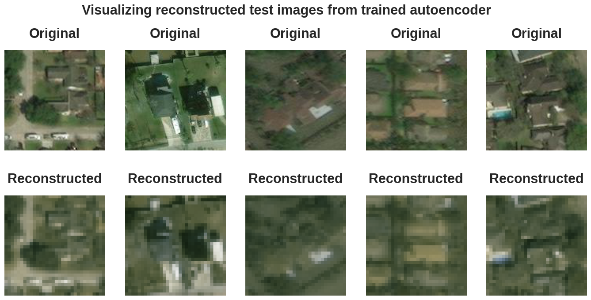
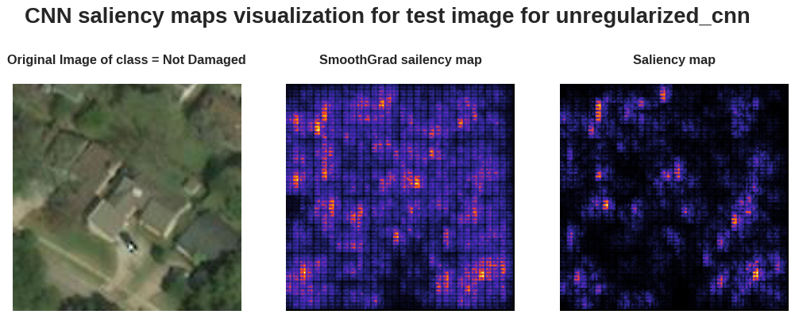

# <b> PROJECT: Hurricane Iota- Damage Classification
  ______________
### <b> DESCRIPTION:
  
  > In the aftermath of Hurricane Iota, which caused 61 fatalities and left 41 people missing, assessing the damage to the affected areas is crucial for first responders and relief workers to plan and allocate resources effectively. One traditional method of assessing damage is by manually driving around the area and recording the number of damaged buildings, but this can be both time-consuming and labor-intensive. To address this challenge, this project proposes using satellite imagery data to classify buildings as either damaged or undamaged, providing a more efficient and accurate way of measuring the extent of the damage.
  
### <b> PROJECT OBJECTIVE:
  > This project aimed to classify buildings based on their level of damage after hurricane Iota using Convolutional Neural Networks (CNN) and Deep Learning algorithms. The project used post-hurricane aerial images of buildings to train and test the model. The CNN was trained to detect patterns in the images and to classify them as either "damaged" or "undamaged". The Deep Learning algorithms were used to analyze the data and provide insights into the patterns of damage. The results showed that the model achieved high accuracy in identifying damaged buildings, which can help emergency responders prioritize rescue efforts and allocate resources more effectively in the aftermath of natural disasters.

### <b> PROJECT OUTLINE: 
  
  * Load and Pre-process the data
  * Unregularized CNN (Convolution Neural Network Model)
  * Regularized CNN
  * CNN Autoencoders 
  * Visualizing Saliency Maps
  * Summary/ Conclusion

# <b> RESULTS : 
* CNN AUTOENCODERS : 

* SALIENCY MAPS :
  

